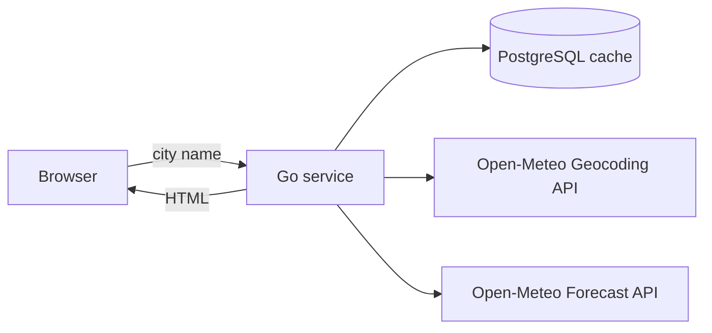

# Weather Panel

A single-screen web panel that shows the current weather for any city. Type a city name and get the temperature,
feels-like temperature, weather condition, humidity, and wind, in Brazilian Portuguese and metric units, using data from
[Open-Meteo](https://open-meteo.com/).

> **Status:** planning. The product requirements and the technical specification are written; implementation has not
> started yet.

## Features

- **City search.** Search by name; when several places share it, the first match is used and the resolved city, region,
  and country are shown.
- **Current conditions.** Temperature and feels-like temperature in °C, condition described in Brazilian Portuguese,
  relative humidity in %, and wind speed in km/h.
- **Clear failures.** Distinct messages for invalid input, city not found, and provider unavailability, always with a
  way to try again.
- **Accessible.** Operable by keyboard, announced to screen readers, and usable from 360 px wide.
- **Private by design.** No accounts and no search history; the browser talks only to the application, never directly
  to third parties.

## How it works

The Go service renders HTML on the server and htmx swaps the result into the page, so the search also works without
JavaScript. The service resolves the city through the Open-Meteo Geocoding API, fetches the current conditions from the
Forecast API, and keeps recent responses in PostgreSQL to answer faster and stay within the provider's rate limits.

## Tech stack

- [Go](https://go.dev/) with the [chi](https://github.com/go-chi/chi) router
- [PostgreSQL](https://www.postgresql.org/) through [pgx](https://github.com/jackc/pgx), with queries generated by
  [sqlc](https://sqlc.dev/) and migrations by [golang-migrate](https://github.com/golang-migrate/migrate)
- [templ](https://templ.guide/) for HTML components and [htmx](https://htmx.org/) for partial page updates
- [Tailwind CSS](https://tailwindcss.com/), built with the standalone CLI
- [Docker](https://www.docker.com/) and Docker Compose

## Documentation

- [Product Requirements Document](docs/prd.md): what the panel must do and why.
- [Technical Specification](docs/techspec.md): architecture, integration, caching, and build decisions.

## Getting started

Build and run instructions will be added with the first implementation. The planned setup is described in the
[technical specification](docs/techspec.md#build-and-run).

## Data and attribution

Weather and location data are provided by [Open-Meteo.com](https://open-meteo.com/) under the
[CC BY 4.0](https://creativecommons.org/licenses/by/4.0/) license. The free Open-Meteo API is for non-commercial use;
anyone running their own instance must follow the [Open-Meteo terms](https://open-meteo.com/en/terms).

## License

This project is licensed under the [MIT License](LICENSE).
