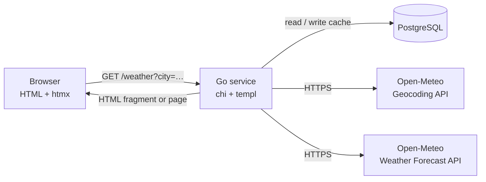
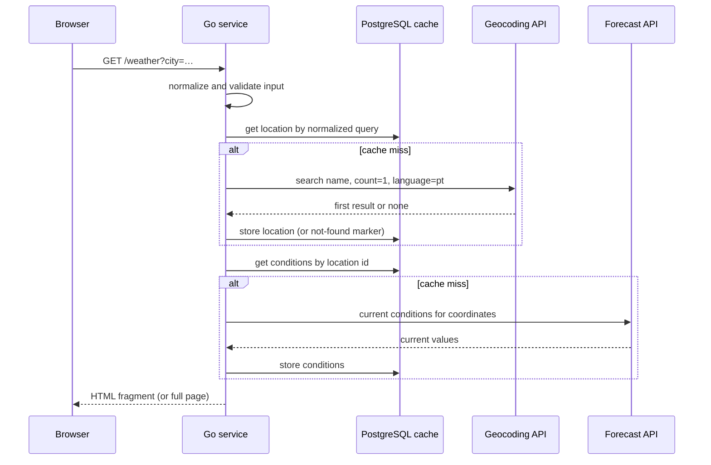

# Technical Specification

## Overview

This document describes how the weather panel defined in the [PRD](prd.md) will be built. The PRD states what the
product must do and stays technology-agnostic; this specification records the stack, the architecture, and the
implementation decisions. Requirement and acceptance criterion IDs (FR*, AC-*) refer to the PRD.

The application is a single Go service that renders HTML on the server. It resolves the city through the Open-Meteo
Geocoding API, fetches the current conditions through the Open-Meteo Weather Forecast API, and returns a
ready-to-display HTML fragment. The browser only ever talks to this service, which satisfies FR14 by construction.

## Stack

Versions are the latest stable releases as of 2026-09-23 and must be pinned in `go.mod`, the Dockerfile, and the
vendored assets.

| Component       | Version            | Role                                                                    |
|-----------------|--------------------|-------------------------------------------------------------------------|
| Go              | 1.27               | Language and standard library (`net/http`, `log/slog`, `embed`)         |
| chi             | v5.3               | HTTP router and middleware (`github.com/go-chi/chi/v5`)                 |
| PostgreSQL      | 18                 | Cache for Open-Meteo responses                                          |
| pgx             | v5.11              | PostgreSQL driver and connection pool (`pgxpool`)                       |
| sqlc            | v1.31              | Type-safe Go code generated from SQL queries                            |
| golang-migrate  | v4.20              | Schema migrations, run by the application at startup                    |
| templ           | v0.3.1020          | HTML components compiled to Go                                          |
| htmx            | 4.0                | Partial page updates without a client-side application                  |
| Tailwind CSS    | 4.3 (standalone)   | Styling, compiled at build time by the standalone CLI (no Node.js)      |
| Docker          | Engine + Compose   | Container image and local environment (app + PostgreSQL)                |
| chromedp        | v0.16              | Browser tests driving a local Chrome (test only, no Node.js)            |

htmx 4 changed several defaults relative to htmx 2. This specification relies on the htmx 4 behavior, so the project
must not downgrade:

- Error responses (`4xx`, `5xx`) are swapped into the target like any other response; only `204` and `304` are not.
- `hx-disable` disables elements during a request (it was `hx-disabled-elt` in htmx 2).
- Attribute inheritance is explicit (`:inherited`); nothing in this design depends on inheritance.
- Requests use `fetch()` and are restricted to the same origin by default (`htmx.config.mode = 'same-origin'`).

## Architecture



- **Server-side rendering.** templ components render every state of the panel (empty, result, validation error, not
  found, unavailable). htmx replaces the result region with the fragment returned by the server.
- **Progressive enhancement.** The search form is a regular `GET` form. Without JavaScript, the browser performs a full
  page navigation and the server renders the whole page with the result.
- **Cache.** PostgreSQL stores recent geocoding and weather responses to reduce latency (AC-09) and the number of calls
  to Open-Meteo. The cache is best-effort: if the database is unavailable at runtime, lookups go straight to Open-Meteo.
- **Single binary.** Static assets and migrations are embedded with `embed`, so the container holds one executable.

## Project layout

```text
cmd/weather-panel/main.go   entry point: config, migrations, wiring, HTTP server, graceful shutdown
internal/config/            configuration read from environment variables
internal/web/               chi router, handlers, middleware (logging, security headers)
internal/weather/           input normalization and validation, lookup service, outcome types, WMO code mapping
internal/openmeteo/         HTTP client for the Geocoding and Weather Forecast APIs
internal/cache/             PostgreSQL-backed cache built on the sqlc queries
internal/store/             sqlc generated code (committed)
internal/view/              templ components and their generated *_templ.go files (committed)
db/embed.go                 embeds db/migrations for golang-migrate (iofs source)
db/migrations/              golang-migrate SQL files (NNNNNN_name.up.sql / .down.sql)
db/queries/                 SQL queries consumed by sqlc
web/embed.go                embeds web/static
web/static/js/htmx.min.js   vendored htmx 4.0.0 (served from the same origin)
web/static/css/app.css      Tailwind output (built, not committed)
web/styles/app.css          Tailwind entry point
test/browser/               browser tests (chromedp, `browser` build tag)
sqlc.yaml
compose.yaml
Dockerfile
Makefile
```

Generated code from sqlc and templ is committed so that `go build` works on a fresh clone without the generators; a CI
step regenerates it and fails if the working tree changes. templ and sqlc are pinned as Go tool dependencies (`tool`
directive in `go.mod`) and run with `go tool templ generate` and `go tool sqlc generate`.

## HTTP interface

| Method | Path            | Purpose                                                                             |
|--------|-----------------|-------------------------------------------------------------------------------------|
| GET    | `/`             | Full page with the search form and an empty result region                           |
| GET    | `/weather`      | Performs a lookup for the `city` query parameter                                    |
| GET    | `/static/*`     | Embedded assets (htmx, CSS) with long-lived cache headers                           |
| GET    | `/healthz`      | Liveness probe; returns `200` while the process is serving requests                 |

`/weather` returns an HTML fragment for the result region when the request carries `HX-Request: true`, and the full page
otherwise (no-JavaScript fallback). The response sets `Vary: HX-Request`. The status code reflects the outcome, and
htmx 4 swaps every one of them into the result region:

| Outcome                  | Status | PRD            | Content                                                             |
|--------------------------|--------|----------------|---------------------------------------------------------------------|
| Success                  | 200    | FR3–FR8, FR13  | Resolved location, conditions, Open-Meteo attribution               |
| Invalid input            | 422    | FR2            | Validation message explaining how to correct the search             |
| City not found           | 404    | FR10           | Message stating the city was not found and inviting a new search    |
| Upstream error           | 502    | FR10–FR12      | Temporary unavailability message inviting the user to try again     |
| Upstream timeout         | 504    | FR10–FR12      | Same message as the upstream error                                  |

Every outcome replaces the whole result region, so a previous result is never left next to a new error (FR12).

## Lookup flow



### Input normalization and validation

1. Trim leading and trailing whitespace and collapse internal runs of whitespace into a single space.
2. Normalize to Unicode NFC so that composed and decomposed accents are treated alike.
3. Reject the input when it has fewer than two meaningful characters, counted as Unicode letters or digits (runes, not
   bytes, so "Ré" is valid). This matches the Geocoding API, which returns nothing for one-character names and requires
   an exact match for two-character names.
4. Reject inputs longer than 100 characters, a technical limit that protects the service and the upstream API.

The cache key is the normalized input in lower case.

### Location resolution (Geocoding API)

`GET https://geocoding-api.open-meteo.com/v1/search?name=<city>&count=1&language=pt&format=json`

- The first element of `results` is the resolved location (FR3). A missing or empty `results` array means the city was
  not found.
- Fields used: `id`, `name`, `latitude`, `longitude`, `admin1`, `country`. The API omits empty fields, so `admin1` and
  `country` are optional and the view shows whatever is available (FR4). `id`, `name`, `latitude`, and `longitude` are
  required; a result without them is treated as an invalid upstream response.
- `language=pt` returns translated names when Open-Meteo has them.

### Current conditions (Weather Forecast API)

`GET https://api.open-meteo.com/v1/forecast?latitude=<lat>&longitude=<lon>&current=temperature_2m,apparent_temperature,relative_humidity_2m,weather_code,wind_speed_10m&temperature_unit=celsius&wind_speed_unit=kmh`

- Units are requested explicitly even though Celsius and km/h are the API defaults, so a change of defaults cannot alter
  the output (FR5, FR8).
- All five `current` values are required; a missing value is treated as an invalid upstream response.
- Open-Meteo updates current conditions from 15-minute model data, which bounds the useful cache lifetime.

### Upstream error handling

- The whole lookup runs under a single deadline of 2.5 seconds, leaving room for rendering and network time within the
  3-second target (AC-09). The deadline is propagated through `context.Context` to both upstream calls.
- There are no retries: the latency budget does not allow them, and the user can retry from the panel (FR11).
- Network errors, non-`2xx` statuses, malformed JSON, and missing required fields become an upstream error (`502`); an
  exceeded deadline becomes an upstream timeout (`504`). Open-Meteo reports request errors as `400` with
  `{"error": true, "reason": "…"}`; the reason is logged, never shown to the user.
- Upstream response bodies are read through a size limit (1 MiB).
- A shared `http.Client` keeps connections alive between requests to avoid a TLS handshake on every lookup.

### Outcome types

`internal/weather` exposes a service that returns either a report or a typed error; handlers map them to the statuses
above. Only the data the view needs crosses this boundary:

```go
type Location struct {
    Name      string
    Admin1    string // optional
    Country   string // optional
    Latitude  float64
    Longitude float64
}

type Conditions struct {
    TemperatureC         float64
    ApparentTemperatureC float64
    RelativeHumidityPct  float64
    WindSpeedKmh         float64
    WeatherCode          int
}

type Report struct {
    Location   Location
    Conditions Conditions
}

var (
    ErrNotFound        = errors.New("city not found")
    ErrUpstream        = errors.New("weather provider unavailable")
    ErrUpstreamTimeout = errors.New("weather provider timed out")
)

// ValidationError carries the user-facing message for invalid input.
type ValidationError struct{ Message string }
```

## Presentation rules

- Temperature and feels-like temperature are rounded to whole degrees and shown as `23 °C` (FR5).
- Relative humidity is shown as a whole percentage, `65%` (FR7).
- Wind speed is rounded to whole kilometers per hour, `12 km/h` (FR8).
- The resolved location is shown as `Name, Admin1, Country`, skipping missing parts (FR4).
- All labels and messages are in Brazilian Portuguese and never expose internal terms (status codes, provider errors).

### Weather code mapping (FR6)

Open-Meteo reports the condition as a WMO weather code. The mapping lives in `internal/weather`:

| Code | Description (pt-BR)               | Code | Description (pt-BR)                  |
|------|-----------------------------------|------|--------------------------------------|
| 0    | Céu limpo                         | 65   | Chuva forte                          |
| 1    | Predominantemente limpo           | 66   | Chuva congelante fraca               |
| 2    | Parcialmente nublado              | 67   | Chuva congelante forte               |
| 3    | Nublado                           | 71   | Neve fraca                           |
| 45   | Nevoeiro                          | 73   | Neve moderada                        |
| 48   | Nevoeiro com geada                | 75   | Neve forte                           |
| 51   | Garoa fraca                       | 77   | Grãos de neve                        |
| 53   | Garoa moderada                    | 80   | Pancadas de chuva fracas             |
| 55   | Garoa intensa                     | 81   | Pancadas de chuva moderadas          |
| 56   | Garoa congelante fraca            | 82   | Pancadas de chuva violentas          |
| 57   | Garoa congelante intensa          | 85   | Pancadas de neve fracas              |
| 61   | Chuva fraca                       | 86   | Pancadas de neve fortes              |
| 63   | Chuva moderada                    | 95   | Trovoada fraca ou moderada           |
|      |                                   | 96   | Trovoada com granizo fraco           |
|      |                                   | 99   | Trovoada com granizo forte           |

An unknown code renders as "Condição não informada" instead of failing the lookup.

## Persistence

PostgreSQL holds only cache data; nothing is tied to a user, a session, or an IP address.

An in-process memory cache or Redis would give the same latency gain, since any of them is far faster than an HTTPS call
to Open-Meteo. PostgreSQL was chosen because it is already part of the stack, survives restarts, and is shared by every
instance of the service without adding another component.

The geocoding cache stores the normalized city text for up to 30 days. The PRD allows provider responses to be kept for
a limited time as long as they are not linked to a user, session, or IP address and are never presented as a search
history; this cache meets all three conditions and expires on its own.

```sql
CREATE TABLE geocoding_cache (
    query       text PRIMARY KEY,           -- normalized, lower-cased input
    found       boolean NOT NULL,           -- false caches a "not found" answer
    location_id bigint,
    name        text,
    admin1      text,
    country     text,
    latitude    double precision,
    longitude   double precision,
    expires_at  timestamptz NOT NULL
);

CREATE TABLE weather_cache (
    location_id            bigint PRIMARY KEY,  -- Open-Meteo geocoding id
    temperature_c          double precision NOT NULL,
    apparent_temperature_c double precision NOT NULL,
    relative_humidity_pct  double precision NOT NULL,
    wind_speed_kmh         double precision NOT NULL,
    weather_code           integer NOT NULL,
    expires_at             timestamptz NOT NULL
);

CREATE INDEX ON geocoding_cache (expires_at);
CREATE INDEX ON weather_cache (expires_at);
```

| Entry                   | Lifetime   | Reason                                                      |
|-------------------------|------------|-------------------------------------------------------------|
| Location found          | 30 days    | Place names and coordinates rarely change                   |
| Location not found      | 1 day      | Allows new places to appear without hammering the API       |
| Current conditions      | 10 minutes | Below the 15-minute update interval of the source data      |

- Reads ignore expired rows; writes are upserts (`INSERT … ON CONFLICT … DO UPDATE`).
- A background job deletes expired rows every hour.
- Upstream errors are never cached.
- Queries live in `db/queries/*.sql`; sqlc reads the schema from `db/migrations` (it ignores down migrations) and
  generates code for `pgx/v5` into `internal/store`.
- Migrations are embedded and applied at startup through golang-migrate with the `iofs` source and the `pgx/v5`
  database driver (`pgx5://` URLs). The service refuses to start if migrations fail; after startup, database errors are
  logged and the lookup continues without the cache.

The free Open-Meteo tier allows 600 calls per minute, 5,000 per hour, and 10,000 per day. Because every call now
originates from this service, those limits apply to the whole product; with two calls per uncached lookup, the cache is
what keeps normal usage within them.

## Frontend

### Page structure

templ renders one layout and the components below. The sketch shows the attributes that matter; styling is omitted.

```html
<main>
  <h1>Clima agora</h1>
  <form action="/weather" method="get" role="search"
        hx-get="/weather" hx-target="#result" hx-swap="innerHTML"
        hx-disable="find button" hx-sync="this:drop" hx-indicator="#loading">
    <label for="city">Cidade</label>
    <input id="city" name="city" type="text" maxlength="100" autocomplete="off"
           aria-describedby="city-hint city-error">
    <p id="city-hint">Digite o nome de uma cidade, por exemplo: Recife.</p>
    <button type="submit">Buscar</button>
    <p id="loading" class="htmx-indicator" role="status">Buscando o clima…</p>
  </form>
  <section id="result">
    <!-- result, validation error (#city-error), not found, or unavailable -->
  </section>
  <p id="announcer" class="sr-only" role="status"></p>
</main>
```

Every htmx response also carries the announcement for that outcome, swapped into the announcer out of band:

```html
<div hx-swap-oob="innerHTML:#announcer"><span>Cidade não encontrada. Não encontramos …</span></div>
```

- **Duplicate submissions (FR9, AC-08).** `hx-disable` disables the submit button while the request is in flight and
  `hx-sync="this:drop"` ignores any further submission from the form until it finishes. The input stays enabled so
  focus is not lost.
- **Validation (FR2, AC-05).** The server is the single source of validation messages; the form uses no native
  constraint attributes besides `maxlength`, so every message has the same wording and presentation. The validation
  message element has the id `city-error`, which links it to the input through `aria-describedby`.
- **Announcements (AC-11).** Screen readers learn about each outcome through `#announcer`, a visually hidden status
  region that stays in the page. Every htmx response replaces its content out of band with one text in reading order:
  the location and each reading with its label for a result, the heading and the text for a message. The result region
  itself is not live: a screen reader pass with Orca and Chrome showed that a live region receiving a whole result at
  once is read piece by piece, in the order the browser reports the changes, with labels separated from their values,
  and that part of a message could be dropped. While a lookup is in flight, the stylesheet hides the announcer's
  previous text (`body:has(#loading.htmx-request) #announcer > *`), so the response's text arrives as an addition and
  is announced even when it repeats the previous one, such as a second "unavailable" after a retry. The loading
  indicator keeps its own `role="status"`; the same pass showed that it is announced when a lookup takes long enough
  to show it. Messages are text, never only an icon or a color.
- **Keyboard (AC-10).** The native form, input, and button give a logical focus order; focus stays on the input after a
  lookup. Focus styles use Tailwind `focus-visible:` utilities with a visible outline.
- **Attribution (FR13, AC-13).** The result component ends with "Dados meteorológicos por
  [Open-Meteo.com](https://open-meteo.com/)", next to the conditions.

### Styling

- Tailwind runs through its standalone CLI; the project has no Node.js toolchain.
- `web/styles/app.css` contains `@import "tailwindcss";` and a `@source` directive pointing at `internal/view`, so
  classes used in `.templ` files are always detected.
- The layout is mobile-first and must work from 360 px wide without horizontal scrolling (AC-12). Text and control
  colors must meet WCAG AA contrast.

## Security and privacy

- **Content Security Policy.** Every response sets
  `default-src 'self'; script-src 'self'; style-src 'self'; img-src 'self' data:; connect-src 'self'; form-action 'self'; base-uri 'none'; frame-ancestors 'none'`.
  `connect-src 'self'` makes the browser itself refuse any request to Open-Meteo or another third party (FR14, AC-04).
  htmx 4 injects its indicator CSS as a constructable stylesheet, so no inline style exception is needed. The design
  uses no `hx-on` handlers or inline scripts.
- **Other headers.** `X-Content-Type-Options: nosniff` and `Referrer-Policy: no-referrer`. The latter keeps the
  `?city=` query of the no-JavaScript result page from leaking when the user follows the Open-Meteo link.
- **Logging.** Structured JSON logs through `log/slog`. The request logger records method, route pattern, status, and
  duration, never the query string. Lookup logs record outcome, cache hits, and upstream latency, never the city or
  the resolved location. IP addresses are not logged.
- **Server limits.** `http.Server` sets read-header, read, write, and idle timeouts; the input length limit applies
  before any upstream call.
- **No secrets.** The free Open-Meteo tier needs no API key.

## Configuration

| Variable                   | Default                                          | Purpose                              |
|----------------------------|--------------------------------------------------|--------------------------------------|
| `PORT`                     | `8080`                                           | HTTP listen port                     |
| `DATABASE_URL`             | (required)                                       | PostgreSQL connection string         |
| `LOG_LEVEL`                | `info`                                           | `debug`, `info`, `warn`, or `error`  |
| `LOOKUP_TIMEOUT`           | `2.5s`                                           | Deadline for the whole lookup        |
| `OPEN_METEO_GEOCODING_URL` | `https://geocoding-api.open-meteo.com/v1/search` | Overridable for tests                |
| `OPEN_METEO_FORECAST_URL`  | `https://api.open-meteo.com/v1/forecast`         | Overridable for tests                |

## Build and run

- **Makefile targets.** `generate` (templ and sqlc), `css` (Tailwind), `build`, `run`, `test`, and `check-generated`
  (fails if regeneration changes the tree).
- **Dockerfile.** A builder stage based on `golang:1.27` downloads the pinned Tailwind standalone binary for the target
  architecture, builds the CSS, and compiles the service with `CGO_ENABLED=0`. The runtime stage is
  `gcr.io/distroless/static:nonroot`, which already provides CA certificates for the HTTPS calls to Open-Meteo.
- **compose.yaml.** Two services: `app` and `db` (`postgres:18-alpine` with a named volume and a `pg_isready`
  healthcheck). `app` starts after `db` is healthy and receives `DATABASE_URL` through the environment.
- **Shutdown.** The service stops accepting requests on `SIGTERM` and waits for in-flight lookups before exiting.

## Testing

| Level            | What it covers                                                                  | Acceptance criteria               |
|------------------|---------------------------------------------------------------------------------|-----------------------------------|
| Unit             | Normalization and validation, WMO mapping, number formatting                    | AC-03, AC-05                      |
| Client           | `internal/openmeteo` against an `httptest.Server`: success, empty results, `400` with reason, malformed JSON, missing fields, timeout | AC-01, AC-06, AC-07 |
| Handler          | Router with a fake Open-Meteo server: status codes, fragment vs. full page, `Vary`, security headers, attribution link | AC-01–AC-03, AC-05–AC-07, AC-13 |
| Integration      | Cache queries and migrations against PostgreSQL from `compose.yaml`             | Cache lifetimes, upserts, cleanup |
| Browser          | Real browser at 360 px and 1280 px: network requests, keyboard flow, loading state, no horizontal scroll | AC-04, AC-08, AC-10, AC-12 |
| Manual           | Screen reader pass over loading, success, validation, and error states         | AC-11                             |
| Performance      | Representative set of cities against the real Open-Meteo, measuring p95 end to end | AC-09                          |

Browser tests use [chromedp](https://github.com/chromedp/chromedp), which drives a local Chrome or Chromium through
the DevTools Protocol from ordinary Go tests, so the project still needs no Node.js toolchain and the tests share the
Go test runner, assertions, and module pinning. They live in `test/browser` behind the `browser` build tag, which keeps
`go test ./...` hermetic, and run against the panel started by `docker compose up` (`make test-browser`, or set
`BROWSER_TEST_URL` for another address). To observe a lookup in flight (AC-08), they hold the `/weather` request with
the DevTools `Fetch` domain instead of relying on network timing. They search the real Open-Meteo, so a search that
must show a result is retried when the first attempt reports the provider unavailable.

## Open questions

1. **Go version on development machines.** The spec targets Go 1.27. Machines with an older toolchain will download
   1.27 automatically when `GOTOOLCHAIN` is `auto` (the default), or need a manual upgrade.
